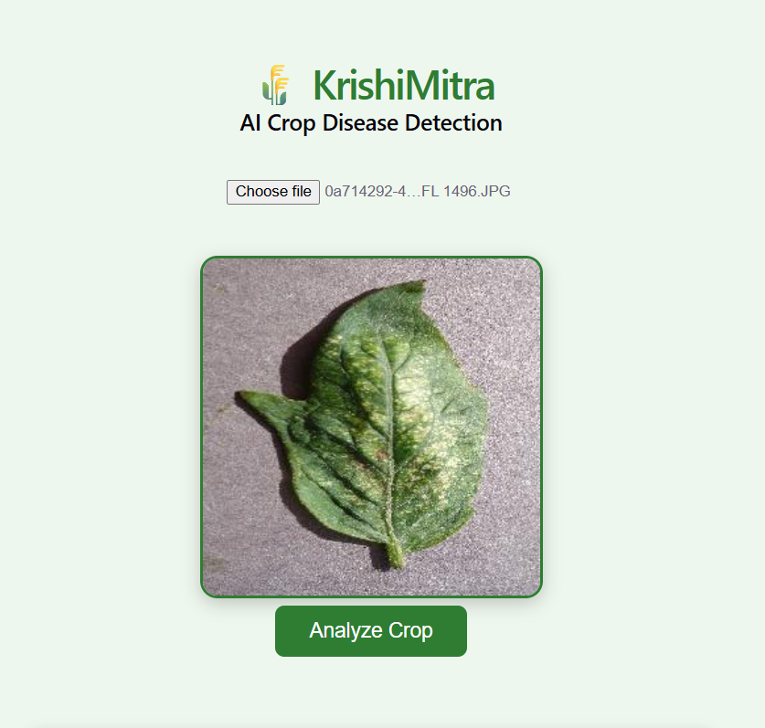
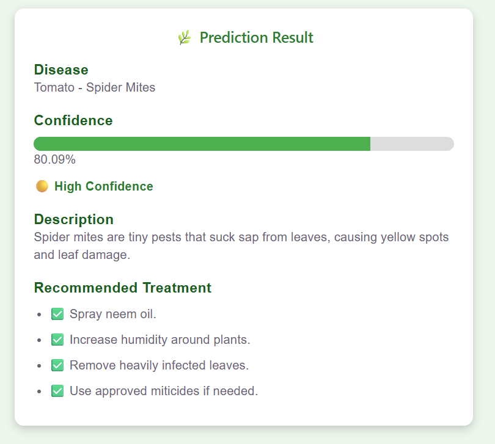

# 🌾 KrishiMitra AI

## 📸 Application Screenshots

### 🏠 Home Page



---

### 🤖 Prediction Result



An AI-powered crop disease detection system that helps identify diseases in tomato, potato, and pepper plants using Deep Learning. The application allows users to upload a leaf image and instantly receive the predicted disease, confidence score, disease description, and treatment recommendations.

---

## 🚀 Features

- 🌿 Upload crop leaf images
- 🤖 AI-powered disease detection using TensorFlow
- 📊 Confidence score for each prediction
- 📖 Disease description
- 💊 Treatment recommendations
- ⚡ FastAPI REST API
- 🎨 React + Vite frontend
- 📱 Simple and responsive user interface

---

## 🛠️ Tech Stack

### Frontend
- React
- Vite
- Axios
- CSS

### Backend
- FastAPI
- Python
- TensorFlow
- Pillow
- NumPy

### AI Model
- MobileNetV2 (Transfer Learning)
- PlantVillage Dataset
- TensorFlow/Keras

---

## 📂 Project Structure

```text
KrishiMitra/
│
├── ai-model/
│   ├── app.py
│   ├── train.py
│   ├── predict.py
│   ├── requirements.txt
│   └── models/
│
├── frontend/
│   ├── src/
│   ├── services/
│   ├── public/
│   └── package.json
│
├── backend/
│
├── dataset/
│
├── .gitignore
└── README.md
```

---

## ⚙️ Installation

### 1. Clone Repository

```bash
git clone https://github.com/PratikNarote/KrishiMitra.git
cd KrishiMitra
```

### 2. Setup AI Backend

```bash
cd ai-model
python -m venv .venv
```

Activate the virtual environment:

**Windows**

```bash
.venv\Scripts\activate
```

Install dependencies:

```bash
pip install -r requirements.txt
```

Run the API:

```bash
uvicorn app:app --reload
```

Backend will run at:

```
http://127.0.0.1:8000
```

---

### 3. Setup Frontend

```bash
cd frontend
npm install
npm run dev
```

Frontend will run at:

```
http://localhost:5173
```

---

## 📷 Application Workflow

1. Upload a crop leaf image.
2. The image is sent to the FastAPI backend.
3. TensorFlow model predicts the disease.
4. The prediction and confidence score are returned.
5. React displays:
   - Disease name
   - Confidence
   - Disease description
   - Treatment recommendations

---

## 🌱 Supported Crop Diseases

### Pepper
- Bacterial Spot
- Healthy

### Potato
- Early Blight
- Late Blight
- Healthy

### Tomato
- Bacterial Spot
- Early Blight
- Late Blight
- Leaf Mold
- Septoria Leaf Spot
- Spider Mites
- Target Spot
- Yellow Leaf Curl Virus
- Mosaic Virus
- Healthy

---

## 🎯 Future Enhancements

- 🌦️ Weather Integration
- 📍 GPS-based location detection
- 🌾 Crop recommendation
- 💾 MongoDB prediction history
- 👤 User authentication
- 📱 Mobile responsive dashboard
- ☁️ Cloud deployment

---

## 👨‍💻 Developer

**Pratik Gajanand Narote**

B.Tech Computer Science Engineering (Artificial Intelligence)

GH Raisoni College of Engineering and Management, Pune

GitHub: https://github.com/PratikNarote

---

## ⭐ Support

If you found this project useful, please consider giving it a ⭐ on GitHub.